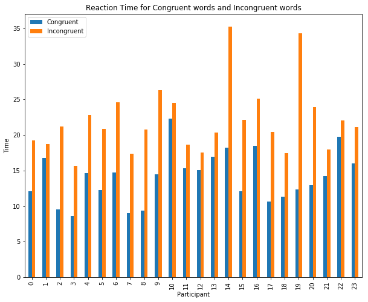

<h1>Statistics: Stroop Effect Project </h1>
Author: Tanbir<br>
Status: Complete<br>
Completion Date: November 2017<br>
<br>
PLEASE READ THE FOLLOWING - Codes are displayed in `.md` file but in `.html` file they are hidden. Text also appears a bit distorted at the bottom because of how `.md` file interprets `.html` tags.

```python
import pandas as pd
from scipy import stats
import matplotlib.pyplot as plt
import seaborn as sns
```


```python
%matplotlib inline
plt.rcParams['figure.figsize'] = 10, 8
```


```python
data_file = 'stroopdata.csv'
data = pd.read_csv(data_file)
diff_data = pd.DataFrame(data['Congruent'] - data['Incongruent'])
```


```python
from IPython.display import HTML
```

<h1>Background Information</h1>

In a Stroop task, participants are presented with a list of words, with each word displayed in a color of ink. The participant’s task is to say out loud the color of the ink in which the word is printed. The task has two conditions: a congruent words condition, and an incongruent words condition. In the congruent words condition, the words being displayed are color words whose names match the colors in which they are printed: for example RED, BLUE. In the incongruent words condition, the words displayed are color words whose names do not match the colors in which they are printed: for example PURPLE, ORANGE. In each case, we measure the time it takes to name the ink colors in equally-sized lists. Each participant will go through and record a time from each condition.
Questions For Investigation

As a general note, be sure to keep a record of any resources that you use or refer to in the creation of your project. You will need to report your sources as part of the project submission.

1. What is our independent variable? What is our dependent variable?<br>
The independent variable here is the condition of the word whether the word is the same name as the ink or a different name as the ink.
The dependant variable is the reaction time for each participant when they say the word out loud.
<br>
<br>
2. What is an appropriate set of hypotheses for this task? What kind of statistical test do you expect to perform? Justify your choices.<br>
Based on the background information we can say that for sure the participants will recite correct words for congruent word set. For Incongruent word set there will be mistakes. So null hypothesis in this case would be that the mean reaction time for the color and congruent set would be equal to or greater than the the incongruent set. The alternate would be that the reaction time for congruent set of words is less than incongruent words.

$H_0$ : $\mu_1 >= \mu_2$ <br>
$H_1$ : $\mu_1 < \mu_2$

$\mu_1$ is the population mean for congruent word reaction time. <br>
$\mu_2$ is the population mean for incongruent word reaction time.

A one-tailed T test has to be done due to the fact that we don't have whole population but a sample of 24 for each and at the same time, we're trying to test if our alternate hypothesis is true where the mean sample of congruent word reaction set is higher than incongruent words. We also know that this is a dependent t-test because there are two condition set on the participant and then each are measured respectively.

Now it’s your chance to try out the Stroop task for yourself. Go to <a href="https://faculty.washington.edu/chudler/java/ready.html" target="_blank">this link</a>, which has a Java-based applet for performing the Stroop task. Record the times that you received on the task (you do not need to submit your times to the site.) Now, download this dataset which contains results from a number of participants in the task. Each row of the dataset contains the performance for one participant, with the first number their results on the congruent task and the second number their performance on the incongruent task.

3\. Report some descriptive statistics regarding this dataset. Include at least one measure of central tendency and at least one measure of variability.

Reports of some descriptive statistic below.

<table>
<tr>
<td><b>Statistic</b></td>
<td><b>Congruent</b></td>
<td><b>Incongruent</b></td>
</tr>
<tr>
<td>n</td>
<td>24</td>
<td>24</td>
</tr>
<tr>
<td>x&#772;</td>
<td>14.051125</td>
<td>22.01591667</td>
</tr>
<tr>
<td>Variance</td>
<td>12.66902907</td>
<td>23.01175704</td>
</tr>
<tr>
<td>&sigma;</td>
<td>3.559357958</td>
<td>4.797057122</td>
</tr>
<tr>
<td>SE</td>
<td>0.7265509007</td>
<td>0.9791951848</td>
</tr>
</table>

4\. Provide one or two visualizations that show the distribution of the sample data. Write one or two sentences noting what you observe about the plot or plots.

From the following histogram we can easily tell that people had a longer reaction time for incongruent words.


```python
fig = data.plot.bar()
fig.set_title('Reaction Time for Congruent words and Incongruent words')
fig.set_xlabel('Participant')
_ = fig.set_ylabel('Time')
```





5\. Now, perform the statistical test and report your results. What is your confidence level and your critical statistic value? Do you reject the null hypothesis or fail to reject it? Come to a conclusion in terms of the experiment task. Did the results match up with your expectations?

Mean difference between sample population mean:<br>
$\frac{\sum_{n=1}^{24}(\bar{x}_{congruent(i)} - \bar{x}_{incongruent(i)})}{24} = -7.964791667$<br>
<br>
Variance between the difference in sample population:<br>

$\frac{\sum_{n=1}^{24}((\bar{x}_{congruent(i)} - \bar{x}_{incongruent(i)}) - (-7.964791667))^2}{23} = 23.66654087$<br>

Standard Deviation:<br>
$\sqrt{23.66654087} = \sigma = 4.86482691$<br>


T value:<br>
$T = \frac{\mu_1 - \mu_2}{\frac{\sigma}{\sqrt{n}}} = -8.020706944$

$\alpha = 0.01$

$T_{critical} = -2.500$

$p-value < 0.01$

After the calculation for the T-statistic we have a value of -8.020706944. Based on our hypothesis we are doing a left-tail t-test. At a confidence level of 99% with a t-critical value of -2.500 and $\alpha$ level of 0.01 with a 23 degree of freedom. The t-statisitic is in the critical region so we reject the null hypothesis. The p-value < 0.01 region.

We come to a conclusion that it takes less time for people to react to congruent words than incongruent words. The difference tells us that it's statistically significant of the reaction time.

6\. Optional: What do you think is responsible for the effects observed? Can you think of an alternative or similar task that would result in a similar effect? Some research about the problem will be helpful for thinking about these two questions!

First of all it has to be clear about the situation, setting and environment that the participants were put forth when presented with this experiment. They were to say it out loud the ink of the words. While presenting these words especially the congruent words sets first, as you can see from the experiment online as well, the person gets very accustomed and lax to the fact these are going to be the words coming later on. Once the sets change and incongruent words are presented it will take the person time to react to it and adapt. If the research started out differently by presenting them complete incongruent word that are set, they're most likely to react to it better later on. It's just how their thought process were being accustomed to as they read congruent words initially that is responsible for the effects observed. There are many type of researches like this and after all this is known as a the stroop effect in psychology. 
<br>
<br>
One example would be Warped Words, a branch of stroop effect, where they have to say the word instead of the color but the words are arrange in a flower shape with colors either matching the word or not matching the word making it difficult to read as they claim but it's the easiest one in reaction time for me. We have others as well called Emotional Stroop test and Reverse Stroop test. Interesting fact stroop test is also used to diagnose disorders such as  schizophrenia, ADHD, ADD etc.

<b> Sources:</b>
<br>https://faculty.washington.edu/chudler/java/ready.html
<br>https://en.wikipedia.org/wiki/Stroop_effect
<br>http://blog.nextgenetics.net/?e=102
<br>https://www.sharelatex.com/learn/Integrals,_sums_and_limits
<br>https://brainstormpsychology.blogspot.com/2013/08/the-stroop-effect.html
<br>https://people.richland.edu/james/lecture/m170/ch09-typ.html


```python
HTML('''<script>
code_show=true; 
function code_toggle() {
 if (code_show){
 $('div.input').hide();
 } else {
 $('div.input').show();
 }
 code_show = !code_show
} 
$( document ).ready(code_toggle);
</script>
The raw code for this is by default hidden for easier reading.
To toggle on/off the raw code, click <a href="javascript:code_toggle()">here</a>.''')
```


<script>
code_show=true; 
function code_toggle() {
 if (code_show){
 $('div.input').hide();
 } else {
 $('div.input').show();
 }
 code_show = !code_show
} 
$( document ).ready(code_toggle);
</script>
The raw code for this is by default hidden for easier reading.
To toggle on/off the raw code, click <a href="javascript:code_toggle()">here</a>.


